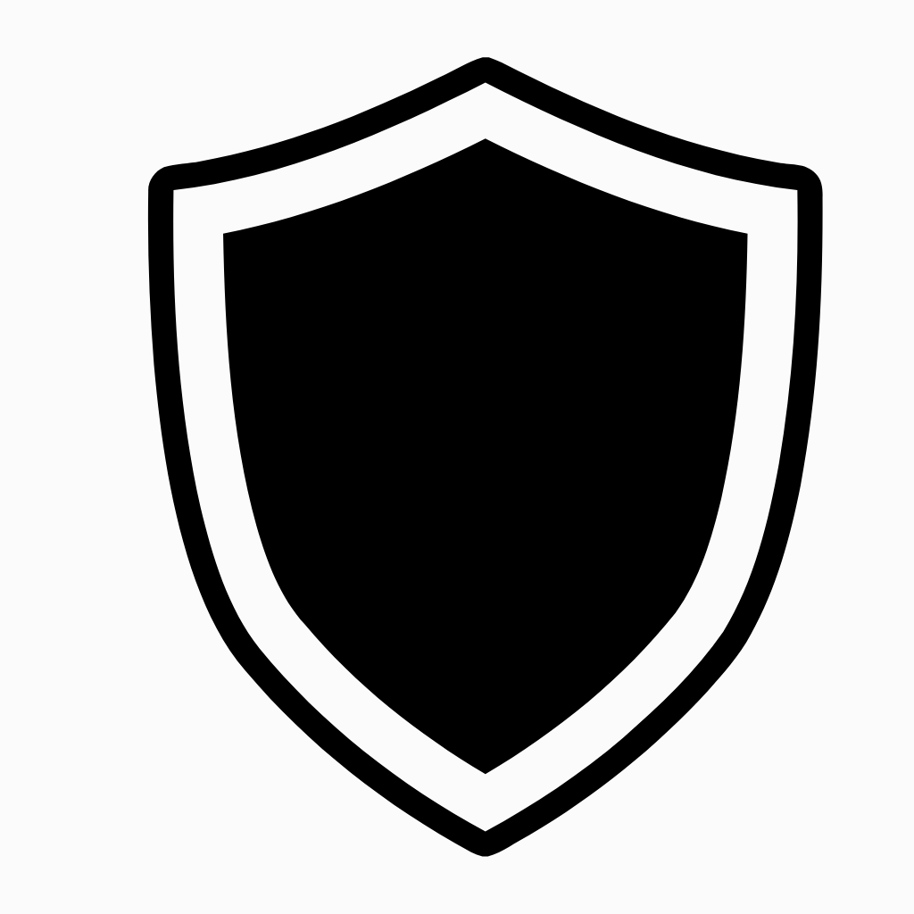

<div align="center" width="100%">
    
</div>


# UpGuardian
## AI-First Uptime & API Monitoring
## Ready to use & easy-to-use self-hosted monitoring tool.

<a target="_blank" href="https://github.com/panditaditya0/UpGuardian"></a> 
<a target="_blank" href="https://github.com/panditaditya0/UpGuardian/releases"></a> 
<a target="_blank" href=""></a>

> A real-time **AI-augmented** monitoring system built with Spring Boot to ensure your APIs, services, infrastructure, and billing operations are always **available**, **secure**, and **predictable**.

---

## Overview

**UpGuardian** is a comprehensive monitoring and alerting solution designed for modern, distributed architectures. It combines **real-time checks** with **AI-powered predictive insights**, helping you take **action before failure**.

Whether you're managing APIs, containers, certificates, queues, or invoices — UpGuardian is your all-in-one solution for intelligent observability.

---


*Main Monitoring Dashboard*


*API Health & Metrics View*

##  Features

-  **REST API Health & Response Time Tracking**
-  **Server Uptime via Heartbeats**
-  **SSL Certificate Expiry Monitoring**
-  **Invoice Payment Alerting**
-  **Docker Microservice Monitoring**
-  **Database Query & Connection Health Checks**
-  **System Resource Usage Alerts (CPU, RAM, Disk)**
-  **Third-party API Availability Monitoring**
-  **DNS Resolution & Domain Monitoring**
-  **Queue (Kafka, RabbitMQ) Throughput & Lag Tracking**
-  **AI-Driven Failure Prediction & Anomaly Detection**
-  **Scheduled Monitoring (every minute or configurable)**

---

## AI-Powered Monitoring

### Predictive Failure Detection
- ML-based models analyze uptime trends to forecast API or service outages before they happen.

### Anomaly Detection
- Detect spikes or unusual behavior in:
  - API latency
  - System metrics
  - Heartbeat delays
  - SSL changes

### Smart Alerting
- Reduces noise and learns from user inputs.
- Adaptive thresholds based on past data.

### Downtime Forecasting
- Projects potential outages based on performance history.

###  Root Cause Suggestions *(experimental)*
- Suggests likely causes for detected failures by analyzing correlated metrics.

---

## Monitoring Modules

### REST API Monitoring
- Health checks for endpoints with configurable HTTP method, payloads, and headers.
- Logs status codes, response time, and body (optional).
- Dashboard with filters and charts.

### Server Uptime (Heartbeats)
- Tracks services with pings or custom endpoints.
- Displays uptime %, downtime streaks, and last seen.

### SSL Certificate Checker
- Monitors domains for certificate expiry.
- Alerts you before expiration to prevent HTTPS failures.

### Invoice Payment Alerts
- Monitors invoice due dates and payment statuses.
- Can sync with billing APIs or internal systems.

### Docker Microservices
- Uses Docker API to track:
  - Container restarts
  - Healthcheck failures
  - Resource spikes (CPU/memory)

### Database Monitoring
- Tracks query latency, connection health, and blocking queries.
- Supports JDBC-compatible databases.

###  DNS & Outbound API Monitoring
- Verifies DNS resolution and third-party API availability.
- Monitors services your app depends on.

###  Queue Monitoring
- Kafka, RabbitMQ support.
- Detects lag, high throughput, or stuck queues.

---

##  Dashboard Features

-  Uptime and response charts (Chart.js)
-  **Dark mode** toggle
-  Real-time toast notifications
-  Group by job, domain, type, or tags
-  AI alerts highlighted with confidence score
-  Custom date range filtering

---

##  Tech Stack

- **Backend:** Spring Boot, Spring Scheduler
- **Frontend:** Thymeleaf, Bootstrap, Chart.js
- **Storage:** PostgreSQL 
- **Optional:** Redis for alert/event caching
- **Containerization:** Docker-ready

---

## Getting Started

### 1. Clone the repo

```bash
git clone https://github.com/your-org/upguardian.git
cd upguardian
